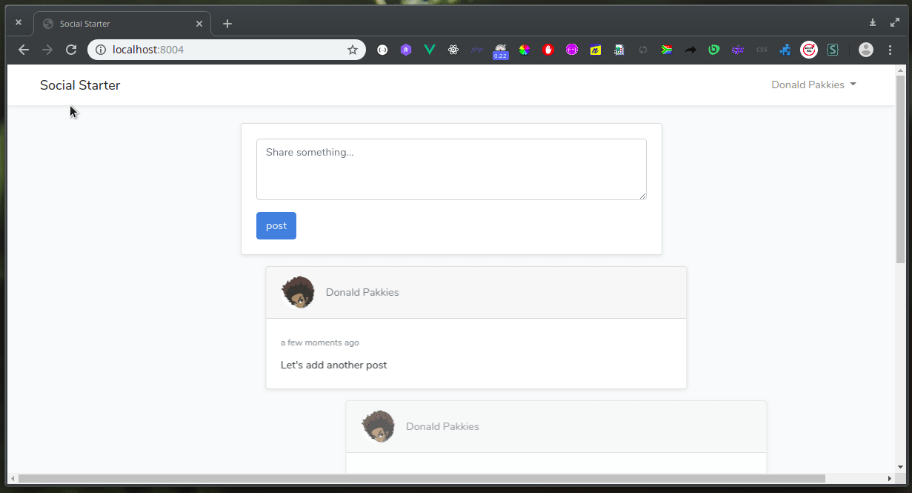

# Social Starter

This project helps you get started with building Laravel based Social Platform.



Requirements
------------
* PHP >=7.3.*
* Nodejs >=8.0.* (if you want to make UI changes)
* MySQL

Getting Started
---------------

## Intro

Create a new database and configure it in the `.env` file.

## Migrate

After configuring your database in the `.env` file, run the migrate command.

```
php artisan migrate
```

## Running

After that has been done, start the application.

```
php -S localhost:8000 -t public/
```

Or

```
php artisan serve
```

Libraries used
--------------
* [axios](https://www.npmjs.com/package/axios)
* [vue-moment-ago](https://www.npmjs.com/package/vue-moments-ago)
* [animate.css](https://daneden.github.io/animate.css/)
* [axios-progress-bar](https://www.npmjs.com/package/axios-progress-bar)
* [vue-sequential-entrance](https://github.com/deivthings/vue-sequential-entrance)

Noticeable features
-------------------
* Lazy loading
